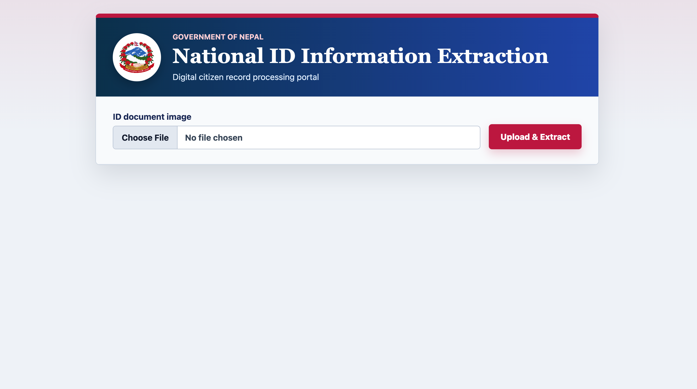

# 🪪 AI-Based ID Information Extraction System

<div align="center">


### Intelligent OCR-Powered Identity Document Information Extraction System

Extract, process, and securely manage information from identity documents using **Artificial Intelligence**, **Optical Character Recognition (OCR)**, and a modern full-stack architecture.

</div>

---

# 📖 Overview

The **AI-Based ID Information Extraction System** is a full-stack web application designed to automatically extract structured information from uploaded identity documents.

Instead of manually entering personal information, users simply upload an image of an ID document, and the system intelligently processes it using OCR technology to identify important details such as:

- Name
- Date of Birth
- Citizenship / ID Number
- Address
- Gender
- Nationality
- Other textual information

The extracted information is then displayed in an organized format and stored securely in the database for future use.

This project demonstrates practical implementation of **Artificial Intelligence**, **OCR**, **Computer Vision**, **Backend API Development**, and **Modern React Frontend Development**.

---
## Sample Preview





---
# 🚀 Features

✅ Upload Identity Documents

✅ AI-Powered OCR Processing

✅ Automatic Text Recognition

✅ Intelligent Information Extraction

✅ Structured Data Display

✅ Secure Backend API

✅ SQLite Database Integration

✅ Responsive Modern UI

✅ Fast Processing

✅ REST API Architecture

---

# 🏗️ System Architecture

```
            User
              │
              ▼
      React + Vite Frontend
              │
              ▼
      Express REST API Server
              │
     Multer File Upload
              │
              ▼
      Tesseract OCR Engine
              │
              ▼
      Text Extraction Engine
              │
              ▼
      Information Parser
              │
              ▼
         SQLite Database
```

---

# 🛠 Tech Stack

## Frontend

- React
- Vite
- CSS3
- Axios

## Backend

- Node.js
- Express.js
- Multer
- Tesseract.js
- dotenv

## Database

- SQLite

## AI / OCR

- Tesseract OCR Engine

---

# 📂 Project Structure

```
AI-Based-ID-Information-Extraction-System/

│
├── Frontend/
│   ├── src/
│   ├── public/
│   ├── assets/
│   ├── package.json
│   └── vite.config.js
│
├── backend/
│   ├── uploads/
│   ├── server.js
│   ├── database.js
│   ├── package.json
│   └── .env
│
└── README.md
```

---

# ⚙️ Installation

## 1 Clone Repository

```bash
git clone https://github.com/dikeshsapkota/ID-Information-Extraction-System.git

cd ID-Information-Extraction-System
```

---

## 2 Backend Setup

```bash
cd backend

npm install
```

Create a `.env`

```env
PORT=5000
```

Start backend

```bash
npm run dev
```

---

## 3 Frontend Setup

```bash
cd Frontend

npm install
```

Create `.env`

```env
VITE_API_URL=http://localhost:5000
```

Run

```bash
npm run dev
```

---

# 🌐 Deployment

## Frontend

Deploy on

- Netlify
- Vercel

Example Environment Variable

```env
VITE_API_URL=https://your-render-backend.onrender.com
```

---

## Backend

Deploy on

- Render
- Railway

---

# 📡 API Endpoint

## Upload ID

```
POST /api/extract-id
```

Form Data

```
idImage
```

Returns

```json
{
  "name": "John Doe",
  "idNumber": "123456789",
  "dateOfBirth": "2000-01-01",
  "rawText": "..."
}
```

---

# 🧠 OCR Workflow

```
Upload Image
      │
      ▼
Store Temporarily
      │
      ▼
Tesseract OCR
      │
      ▼
Extract Raw Text
      │
      ▼
Regex Processing
      │
      ▼
Structured Information
      │
      ▼
Database Storage
      │
      ▼
Frontend Display
```

---

# 🔒 Security Features

- Environment Variables
- Secure API Communication
- File Upload Validation
- Temporary File Handling
- Backend Data Processing
- Database Storage

---

# 🎯 Future Improvements

- AI Model for Better Recognition
- Passport Support
- Driving License Support
- Citizenship Support
- Aadhaar Support
- PAN Card Support
- Face Detection
- QR Code Reading
- Multi-language OCR
- PDF Upload
- User Authentication (Auth0/JWT)
- Cloud Storage
- OCR Accuracy Improvements
- Export to PDF
- Export to Excel
- Admin Dashboard
- Analytics Dashboard

---

# 📚 Learning Outcomes

This project demonstrates practical knowledge of:

- Artificial Intelligence Integration
- Optical Character Recognition (OCR)
- React Development
- Express Backend Development
- REST API Design
- Database Integration
- File Upload Handling
- Environment Variables
- Full Stack Development
- Deployment using Netlify & Render

---

# 👨‍💻 Author

## Dikesh Sapkota

🎓 BSc CSIT Student

💻 Aspiring Full Stack Developer

🌐 GitHub

https://github.com/dikeshsapkota

LinkedIn

https://www.linkedin.com/in/dikesh-sapkota-430831316/

---

# ⭐ Support

If you found this project helpful, consider giving it a ⭐ on GitHub.

---

# 📄 License

This project is licensed under the MIT License.

---

<div align="center">

### ⭐ Built with React, Node.js, SQLite and Tesseract OCR ⭐

**Thank you for visiting this repository!**

</div>
